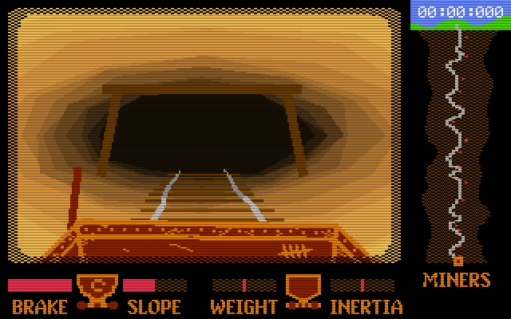

## Miner Rescue

A mini-game written solo in 48 hours for Ludum Dare 48 Compo (https://ldjam.com)

### Synopsis

The year is 1884 and you were just going about your daily shift in a deep iron mine down south when suddenly an earthquake struck and sealed the main entrance!

Luckily there is another exit at the bottom of the mine so without hesitation you jump onto the nearest mining cart and brace yourself for going deep... and fast! The only way is through. But don't forget your fellow miners and let any you see hop on board!

Enjoy a pseudo-3d 8-bit style simple arcade game where you ride a mining cart downhill.. in the dark! You know you always wanted to!!

Written in C++ using raylib targeting Windows. Also used Paint.NET, Aseprite, sfxr, BeepBox and Audacity.

If you'd like to compile the conde yourself, install raylib 3.7.0 (under c:/raylib) with MinGW compiler and use mingw32-make to build.

### Playable in a browser

https://mausimus.github.io/ld48

### Screenshot

