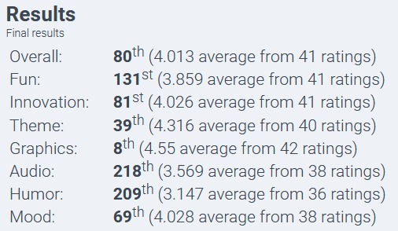

## Miner Rescue

A mini-game written solo in 48 hours for Ludum Dare 48 Compo (https://ldjam.com)

Ranked __8th__ in graphics category and 80th overall!

https://ldjam.com/events/ludum-dare/48/miner-rescue

### Playable in a browser

https://mausimus.github.io/ld48

### Synopsis

The year is 1884 and you were just going about your daily shift in a deep iron mine down south when suddenly an earthquake struck and sealed the main entrance! The tremors are not stopping so you have to get out ASAP!

Luckily there is another exit at the bottom of the mine so without hesitation you jump onto the nearest mining cart and brace yourself for going deep… and fast! The only way is through.

Enjoy a retro-style arcade game where you ride a mining cart downhill.. in the dark! You know you always wanted to!! But don’t forget to STOP to pick up fellow miners!

Written in C++ using raylib targeting Windows, Linux and HTML5. Also used Paint.NET, Aseprite, sfxr, BeepBox and Audacity.

If you'd like to compile the code yourself install raylib 3.7.0 (with MinGW compiler if on Windows) and use make (or mingw32-make) to build.
